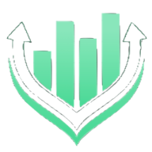

#  ManStack
**ManStack** is a modern full-stack project management application built for individuals and teams (which will be developed) to collaborate, organize and execute projects efficiently.

## Features
- **Project Management** — Create and manage multiple projects
- **Task Tracking** — Assign, update, and complete tasks across boards
- **User Authentication** — Secure login/logout functionality
- **Due Dates & Statuses** — Keep track of deadlines and progress

## Tech Stack

**ManStack** is built with a modern set of technologies that ensure scalability, responsiveness, and a smooth user experience.

- **Frontend**:
  - HTML5
  - CSS
  - EJS (Embedded JavaScript Templates)

- **Backend**:
  - Node.js
  - Express.js

- **Database**:
  - MongoDB
  - Mongoose

- **Authentication**:
    - Express-session

- **Version Control**:
  - GitHub

- **Deployment**:
  - Heroku
  - GitHub

- **Other Tools**:
  - Bcrypt.js

## ERD Structure

- **Relation**  

## Management Board
- **ManTrack** App Management Board using Trello  

## External Links used for this project
- https://www.w3schools.com/html/
- https://developer.mozilla.org/en-US/docs/Learn_web_development/Extensions/Server-side/Express_Nodejs/routes
- https://developer.mozilla.org/en-US/docs/Learn_web_development/Core/CSS_layout/Flexbox

## Future Improvements
- **Collaboration Tools** - Share files, comments, and updates within your projects. Keep everyone in the loop and improve communication.
- **Team Management** - Add and manage team members with role-based permissions. Assign tasks, set responsibilities, and control access.
- **Notifications** - Get real-time notifications for task updates, project changes, and upcoming deadlines to keep your team informed.
- **Time Tracking** - Log hours worked on tasks and projects to better understand time spent and improve efficiency.
- **Project Templates** - Save and reuse project structures to accelerate the creation of new projects and maintain consistency.
- **Progress Analytics** - Visualize your project’s progress with interactive charts and graphs to stay informed on milestones and performance.
- **Integration with Calendar** - Sync deadlines, milestones, and important dates with your external calendar for better organization.
- **Task Prioritization** - Assign priority levels to tasks to ensure critical work is completed on time.

